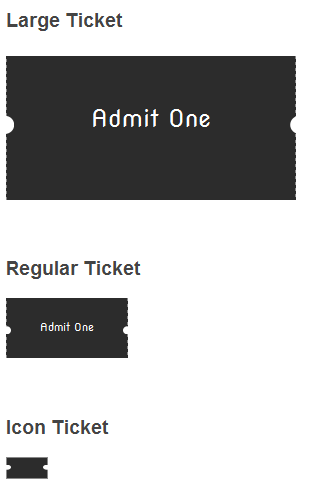

# Tickets in CSS
I wanted to create a ticket shape in CSS and was challenging myself to create it in various sizes.

I tried to make it easy to resize using 'ems' instead of pixels in as many places as possible.

Check it out the result below:

### License
MIT

##### Copyright 2015 Jef Lippiatt